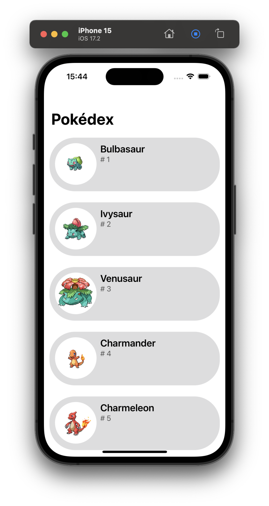
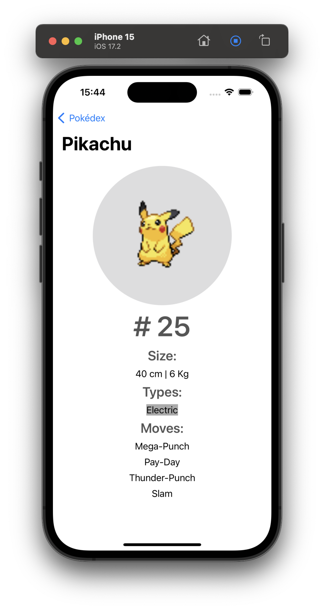

# Pokédex App (MVVM)

A sample Pokédex app using MVVM architecture. The app features are:

- A Pokémon list featuring the 151 Pokémon from the first generation.
- A details screen, with information about the Pokémon's name, id, size, types and moves.

I've built it with the Model View View-Model architecture (MVVM), for it keeps the code cleaner and easier to support. I've used a third-party library for image loading and caching.

## Screenshots
 

## Instalation

First of all, download this repo

```
git clone https://github.com/rodrigowoulddo/pokedex-app-MVVM.git
cd pokedex-app-MVVM
```

Then install third-party libraries

```
pod install
```

And finally, open it using Xcode to launch in any iOS device or simulator

```
xed .
```